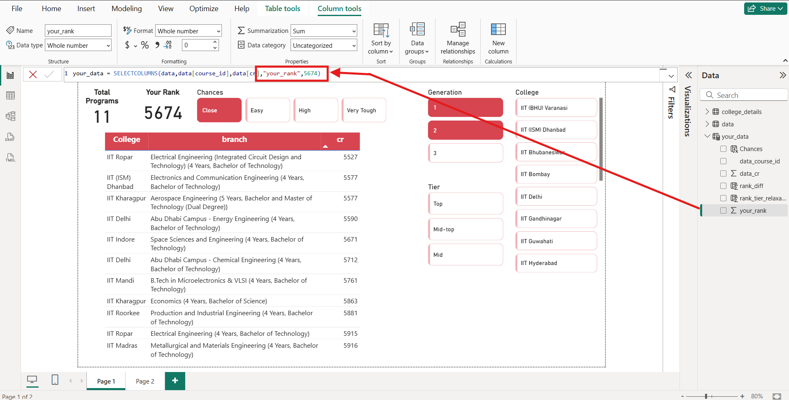

# 🎓 JEE Counseling Seat Predictor

An **interactive tool** to help JEE aspirants make informed decisions during JoSAA counseling.  
It predicts the availability of college programs based on the aspirant’s rank, applying data cleaning, web scraping, and classification logic, and visualizing results with **Power BI**.

---

## 🚀 Features
- ✅ Enter your JEE rank and instantly view the number of available programs.  
- ✅ Smart **classification** of program chances:
  - **Close** – rank is near the cutoff.  
  - **High Chances** – comfortably above the cutoff.  
  - **Easy to Get** – much safer margin.  
  - **Very Tough** – unlikely.  
- ✅ Filters for **College Name**, **Tier**, and **Generation**.  
- ✅ Cleaned and structured **closing rank data** via Pandas.  
- ✅ Web scraping of official data using **BeautifulSoup**.  
- ✅ Rich and interactive **Power BI dashboard**.

---

## 📊 Data Processing
- **Web Scraping**: Collected closing rank data from official sources using `BeautifulSoup`.  
- **Data Cleaning**: Handled missing values, normalized formats, and split text columns with `Pandas`.  
- **Logic Applied**: Rank relaxation logic based on student rank bands:

| Rank Range         | Relaxation (Seats) |
|--------------------|--------------------|
| `< 2000`           | +50                |
| `2001 – 4000`      | +100               |
| `4001 – 7000`      | +250               |
| `7001 – 11000`     | +500               |
| `> 11000`          | +500               |

---

## 📈 Visualization
The **Power BI dashboard** allows:
- Filtering by **College / Tier**  
- Viewing **chance classification**  
- Insights into **available programs**  

  
*(Add screenshot of your Power BI dashboard here)*

---

## 🛠️ Tech Stack
- **Python**: Data collection & cleaning  
  - `pandas`, `numpy`, `beautifulsoup4`  
- **Power BI**: Data visualization & interactive dashboard  
- **GitHub**: Version control & project sharing  

---

## 🧭 Future Scope
- 📌 Add **advanced filtering & sorting** features.  
- 📌 Build a **web app** (Streamlit/Django) for direct user input.  
- 📌 Predict **JEE Main results** and include **non-IIT institutes**.  
- 📌 Enable **category & gender-based predictions**.  
- 📌 Provide direct **links to official institute websites**.  

---

## 📂 Project Structure
jee-seat-predictor/
-│── data/ # datasets or sample data
-│── dashboard/ # Power BI files (.pbix)
-│── requirements.txt # Python dependencies
-│── README.md # Project documentation

---

## ⭐ Acknowledgements

- Official JoSAA Data Sources

- Python & Power BI Community
